# picoCTF PIE TIME

## Description:


## Solution:


### Downloaded the source code and the binary, and changed the binary to an executable.

```bash
wget <url_of_sourcecode>
wget <url_of_binary>
```
```bash
sudo chmod +x <binary_file>
```

### I ran the executable, and apparently it's giving me the address of main, and is asking me to enter a memory address to jump to.


### I entered a random value as the input, and the program returned the message "Segfault Occurred, incorrect address" and exited.


### I opened the source code in VScode to take a look at what's going on and I saw a declaration of a function called win that prints the flag but, it was never called in main().

#### win()

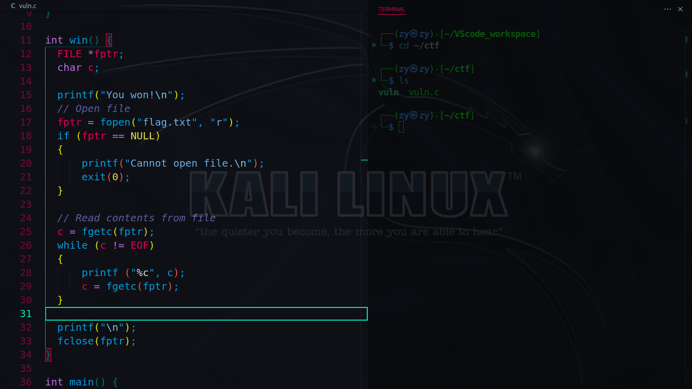


#### main()

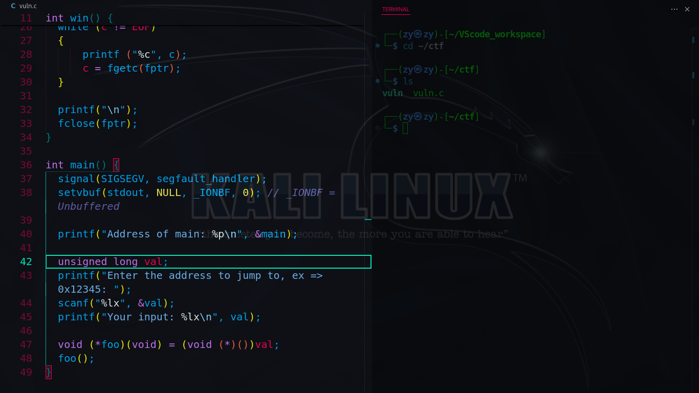

### I tried to manually call win() in main().

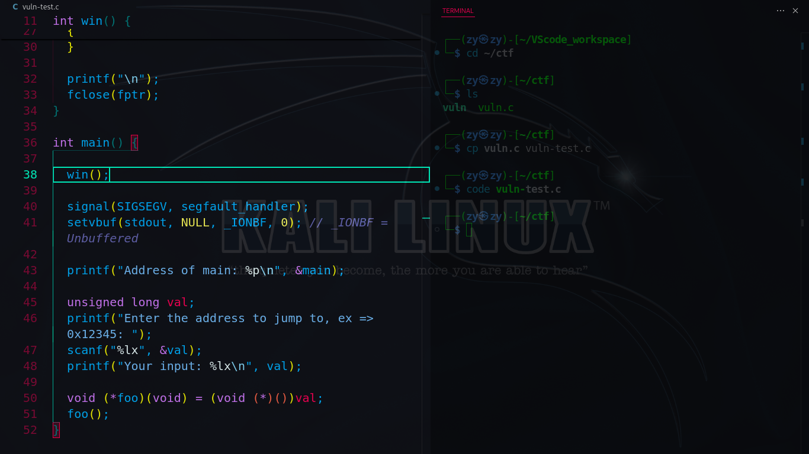

### Recompiled and ran the code, the win() function did execute but, the file "flag.txt" that the win() function reads the flag from, is only available in the target machine. meaning, the only way I can get the flag, is by exploiting the program during runtime while connected to the machine. So no messing with the source code itself.

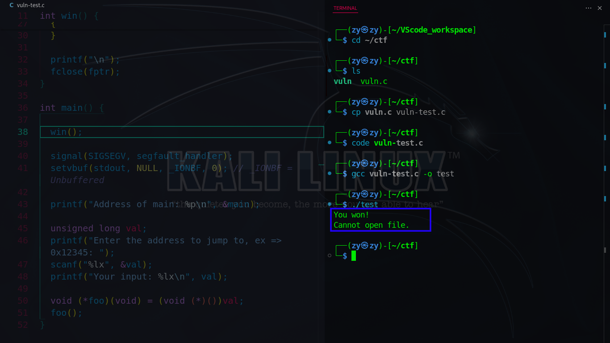


### I disassembled the executable using "objdump" to try and look for some useful memory addresses where I saw, main() being at address 0x133d and win() at address 0x12a7.

```bash
objdump -d ./vuln
```

`-d: disassemble`

### address of main()
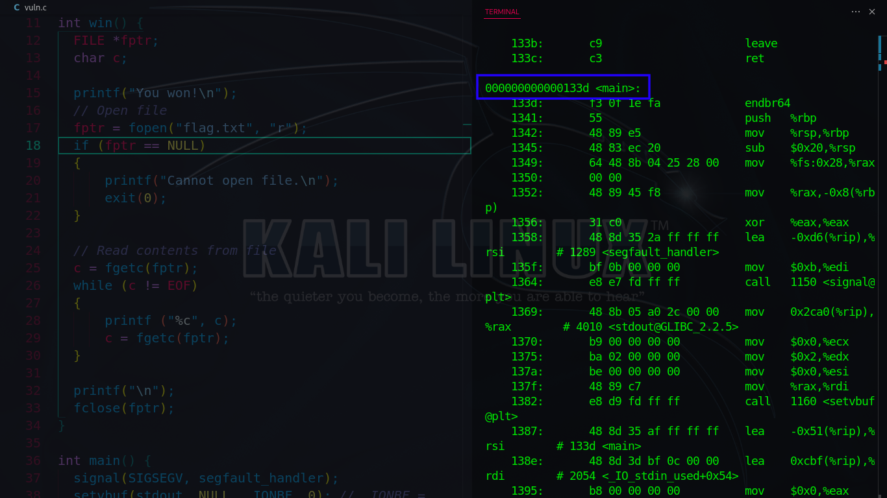

### address of win()
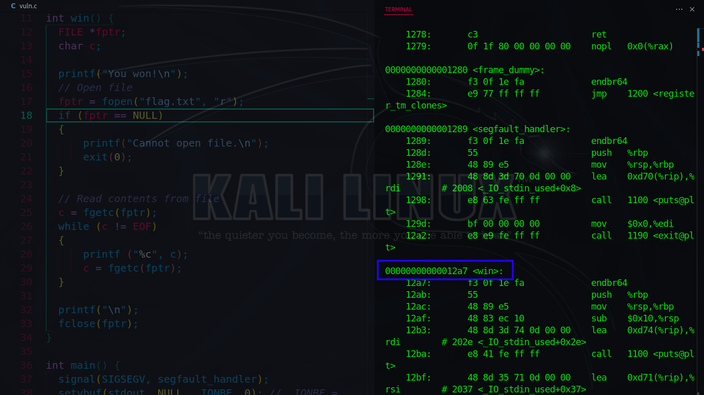


### I ran the executable to try and enter the address of win() that I found as the input to see what happens, which resulted in returning "incorrect address" and exiting the program. I also noticed that the address of main() the program has printed (0x5573ab47433d), is different from the address of main() that I found when I disassembled the executable (0x133d).

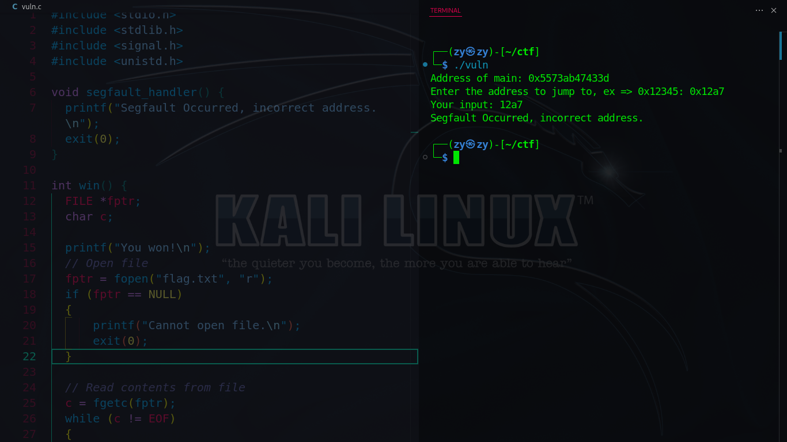


### I searched the challenge's title on the web (PIE TIME) and found useful information on [https://ir0nstone.gitbook.io/notes/binexp/stack/pie](https://ir0nstone.gitbook.io/notes/binexp/stack/pie). PIE = Position Independent Executable, which makes the program run on different memory addresses each time the program is executed. However, while the memory addresses of the executable are randomized, the offset between different parts of the binary is fixed.

### To confirm this, I ran the program a couple of times, and it did indeed return different addresses for main() on each run.

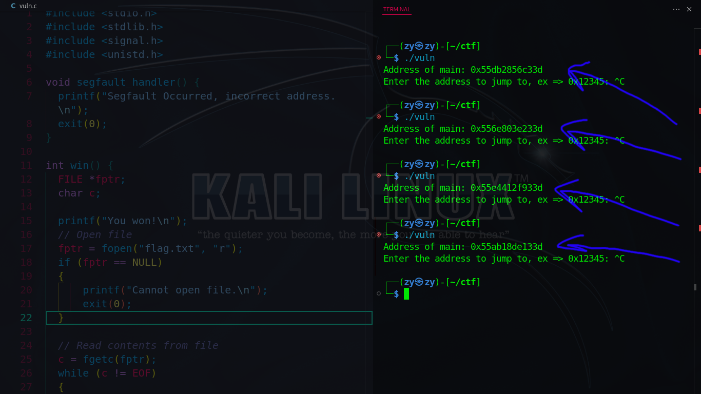


### Another way to see if PIE is enabled, is to use "checksec".

```bash
checksec --file=./vuln
```

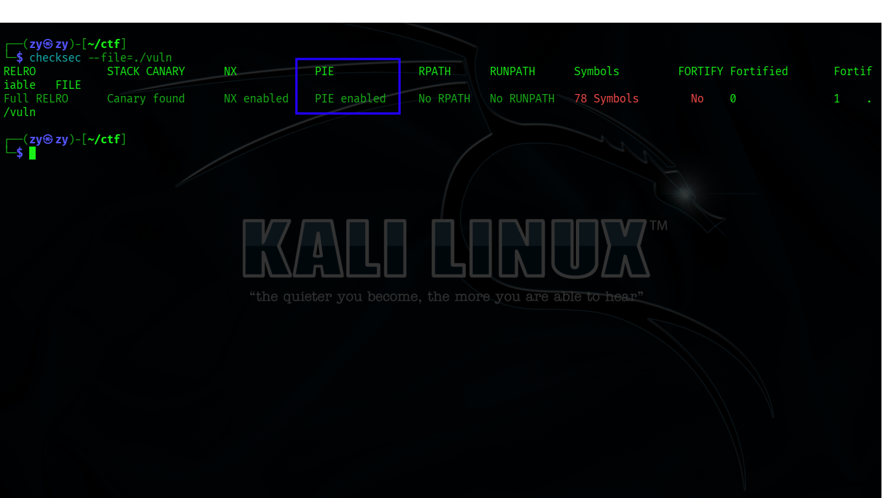

### With this information, I can now calculate the offset between main() and win() locally by subtracting 0x12a7(win()) from 0x133d(main()), which returned 150 in decimal value, or 0x96 in hexadecimal.

#### Calculating using python.

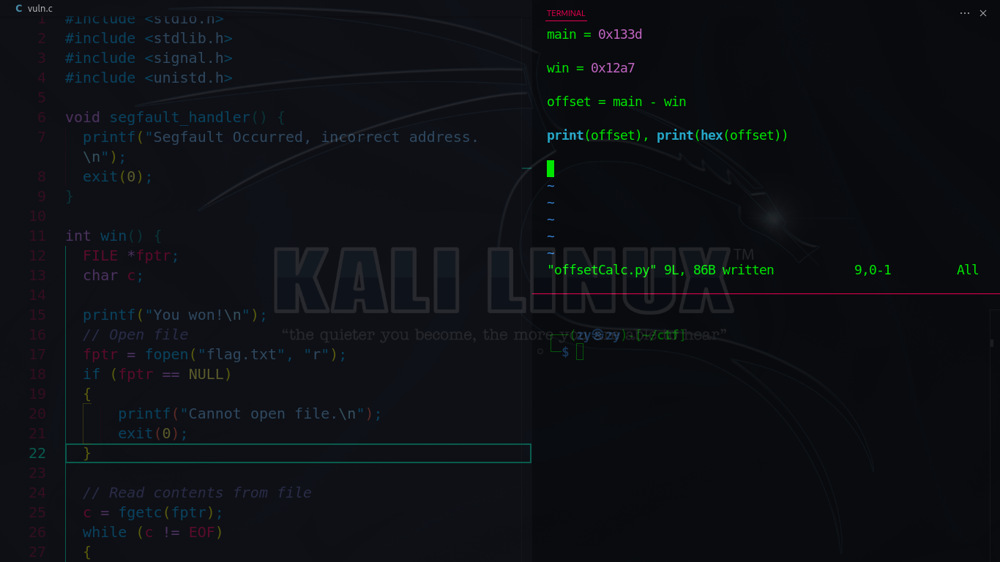


#### offset value.

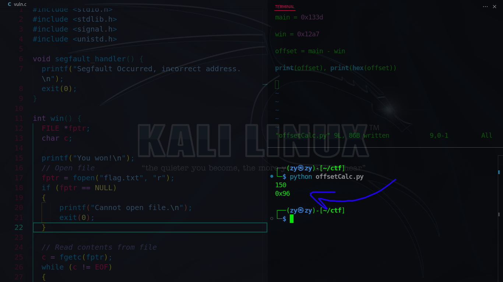


### Now the steps ahead are clear, all I have to do is, connect to the machine with "netcat", get the address of main(), subtract the offset from it (150) or (0x96 in hex) and enter the result (address of win()) in the input prompt. And hopefully, that will execute win() and print the flag for me.

```bash
nc <target_address> <target_port>
```

### Okay, the address of main() is 0x5b079d05533d.


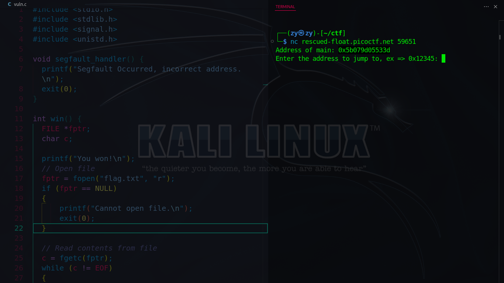


### By subtracting the offset value (150) from main() (0x5b079d05533d), I got the address of win() (0x5b079d0552a7).

#### Calculating using python again.

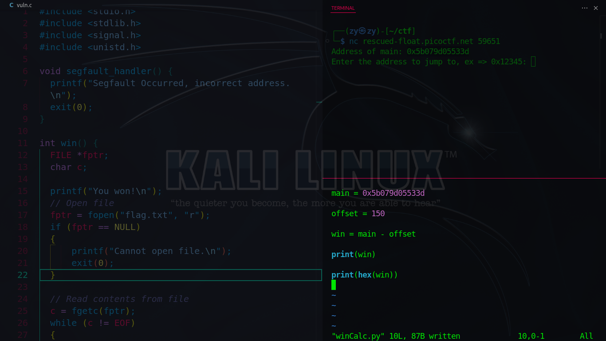

#### Address of win().

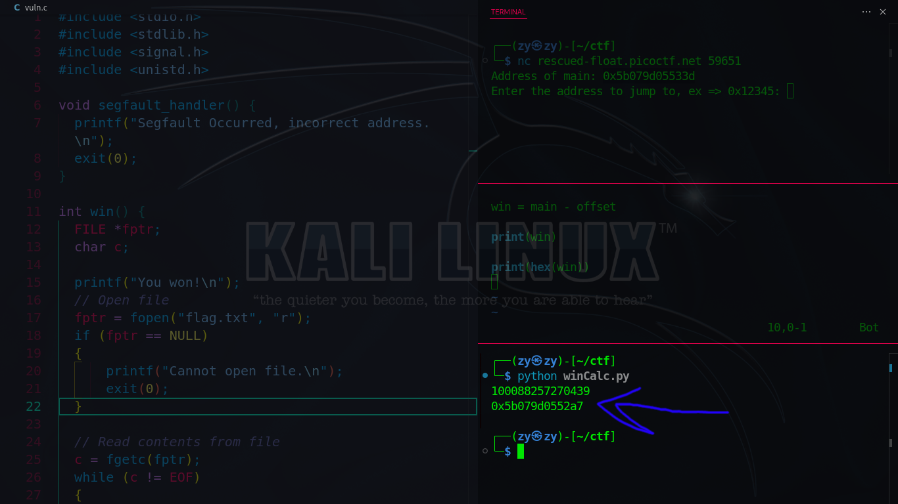


### And, flag obtained!

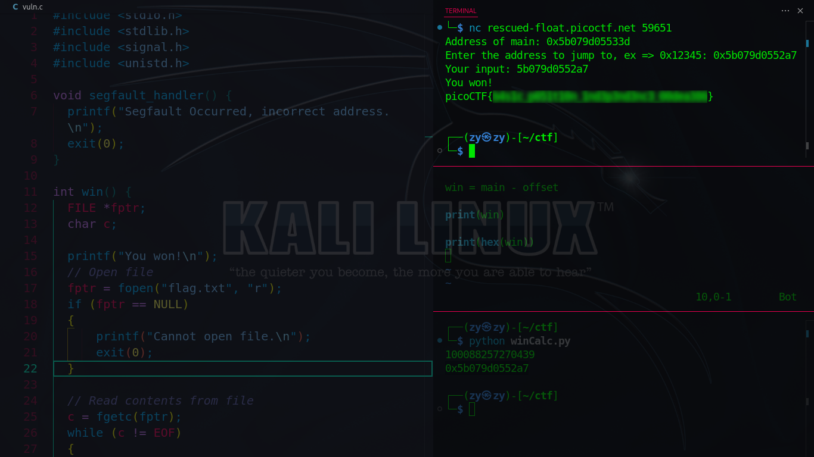

## Conclusion:

### New Things I learned:

- **Position Independent Executable (PIE), and how to exploit it.**

---